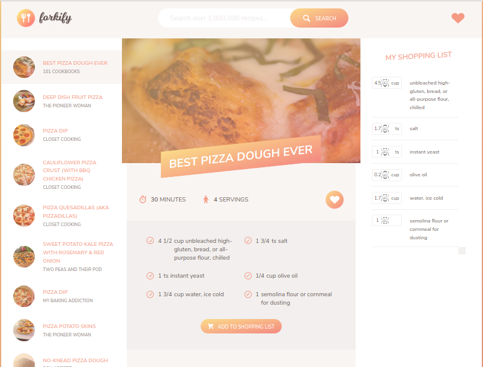

# tastytreat
This is a cooking recipe application. This app search data by using url https://forkify-api.herokuapp.com/api/search?&q=${this.query}
, also fetch individual recipe information by using url  https://forkify-api.herokuapp.com/api/get?rId=${this.id}.

It is a web client app used raw js-ES6, alos used library Description Babel and babel-polyfill (https://babeljs.io/) to convert ECMAScript 2015+ code into a backwards compatible.

In this project axios (Promise based HTTP client https://github.com/axios/axios) used for calling apis. Webpack module bundeler used to bundle javascript modules.

